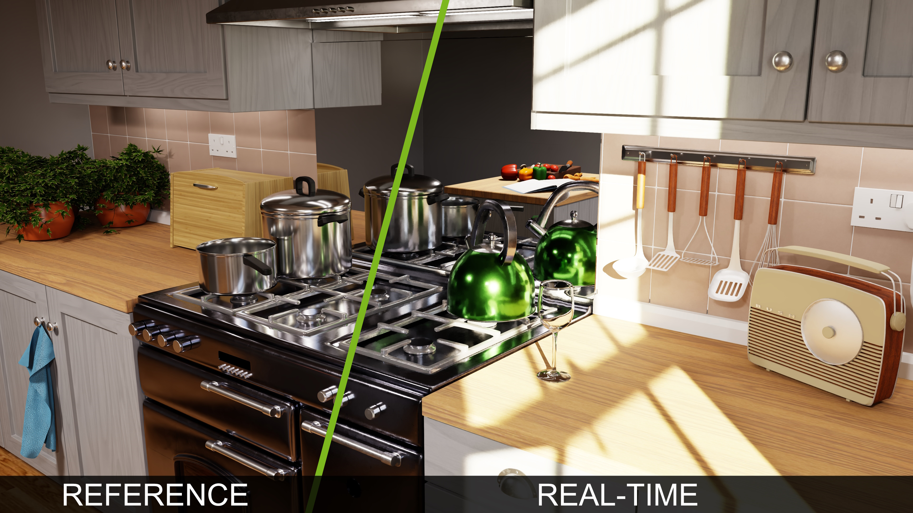
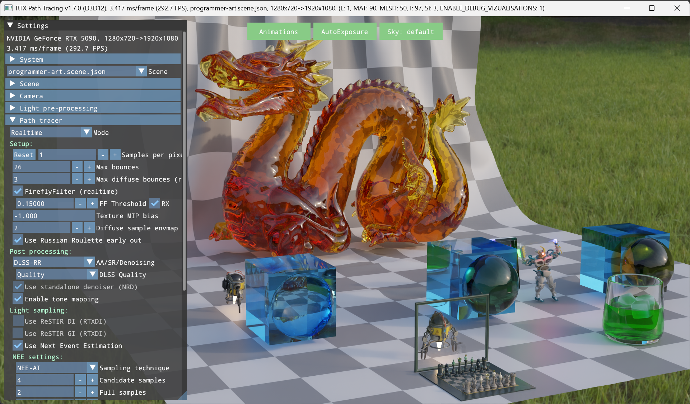

# RTX Path Tracing v1.5.1




## Overview

RTX Path Tracing is a code sample that strives to embody years of ray tracing and neural graphics research and experience. It is intended as a starting point for a path tracer integration, as a reference for various integrated SDKs, and/or for learning and experimentation.

The base path tracing implementation derives from NVIDIA’s [Falcor Research Path Tracer](https://github.com/NVIDIAGameWorks/Falcor), ported to approachable C++/HLSL [Donut framework](https://github.com/NVIDIAGameWorks/donut).

GTC presentation [How to Build a Real-time Path Tracer](https://www.nvidia.com/gtc/session-catalog/?tab.catalogallsessionstab=16566177511100015Kus&search.industry=option_1559593201839#/session/1666651593475001NN25) provides a high level introduction to most of the features.


## Features

* DirectX 12 and Vulkan back-ends
* Reference and real-time modes
* Simple BSDF model that is easy(ish) to extend
* Simple asset pipeline based on glTF 2.0 (support for a subset of glTF extensions including animation)
* Basic volumes and nested dielectrics with priority
* Support for analytic lights (directional, spot, point), emissive triangles and environment map lighting
* NEE lighting with feedback-based, temporaly adaptive importance sampling
* Basic path tracing features scuh as: Low-discrepancy sample generator based on [Practical Hash-based Owen Scrambling](https://jcgt.org/published/0009/04/01/paper.pdf); [RayCones](https://research.nvidia.com/publication/2021-04_improved-shader-and-texture-level-detail-using-ray-cones) for texture MIP selection, early ray termination and similar 
* Basic rasterization features such as: Basic TAA, tone mapping, and similar
* Reference mode 'photo-mode screenshot' with basic [OptiX denoiser](https://developer.nvidia.com/optix-denoiser) integration
* [Shader Execution Reordering](https://developer.nvidia.com/blog/improve-shader-performance-and-in-game-frame-rates-with-shader-execution-reordering/) for significant increase in execution performance
* [RTXDI](https://github.com/NVIDIA-RTX/RTXDI) integration for ReSTIR DI (light importance sampling) and and ReSTIR GI (indirect lighting)
* [OMM](https://github.com/NVIDIA-RTX/OMM) integration for fast ray traced alpha testing
* [NRD](https://github.com/NVIDIA-RTX/NRD) ReLAX and ReBLUR denoiser integration with up to 3-layer path space decomposition
* [RTXTF](https://github.com/NVIDIA-RTX/RTXTF) integration for Stochastic Texture Filtering
* [Streamline](https://github.com/NVIDIAGameWorks/Streamline/) integration for DLSS 4.0 (DLSS SR, DLSS AA, DLSS FG & MFG)


## Requirements

- Windows 10 20H1 (version 2004-10.0.19041) or newer
- DXR Capable GPU (DirectX Raytracing 1.1 API, or higher)
- GeForce Game Ready Driver 572.70 or newer
- DirectX 12 or Vulkan API
- CMake v3.14+
- Visual Studio 2022 (v143 build tools) or later with Windows 10 SDK version 10.0.20348.0 or 10.0.26100.0 or later


## Known Issues

* Enabling Vulkan support requires a couple of manual steps, see [below](#building-vulkan)
* SER, OMM and Streamline support on Vulkan is currently work in progress
* Running Vulkan on AMD GPUs may trigger a TDR during TLAS building in scenes with null TLAS instances
* We recommend using *NVIDIA Nsight Graphics* graphics for frame capture and analysis. If using other GPU performance tuning and debugging tools such as *PIX on Windows*, it is advisable to disable NVRHI_WITH_NVAPI and DONUT_WITH_STREAMLINE variables in CMake to avoid compatibility issues. Please note: disabling these settings results in lower performance and missing features
* There is a known issue resulting in LIVE_DEVICE DirectX warnings reported at shutdown when Streamline is enabled in Debug builds
* There is a known issue resulting in black or incorrect transparencies/reflection on some AMD systems with latest drivers; this is being investigated

## Folder Structure

|						| |  
| -						| - |
| /bin					| default CMake folder for binaries and compiled shaders
| /build				| default CMake folder for build files
| /Assets				| models, textures, scene files  
| /Docs					| documentation 
| /External				| external libraries and SDKs, including Donut, Streamline, NRD, RTXDI, and OMM
| /Tools				| optional command line tools (denoiser, texture compressor, etc)
| /Rtxpt				| **RTX Path Tracing core; Sample.cpp/.h/.hlsl contain entry points**
| /Rtxpt/PathTracer		| **Core path tracing shaders**


## Build

At the moment, only Windows builds are fully supported. We are going to add Linux support in the future.

1. Clone the repository **with all submodules recursively**:
   
   `git clone --recursive https://github.com/NVIDIA-RTX/RTXPT.git`

2. Use CMake to configure the build and generate the project files.
   
   ```
   cd RTXPT
   cmake CMakeLists.txt -B ./build
   ```

   Use `-G "some tested VS version"` if specific Visual Studio or other environment version required. Make sure the x64 platform is used. 

3. Build the solution generated by CMake in the `./build/` folder.

   In example, if using Visual Studio, open the generated solution `build/RTXPathTracing.sln` and build it.

4. Select and run the `rtxpt` project. Binaries get built to the `bin` folder. Assets/media are loaded from `assets` folder.

   If making a binary build, the `assets` and `tools` folders can be placed into `bin` next to executable and packed up together (i.e. the sample app will search for both `Assets/` and `../Assets/`).


## Building Vulkan

Due to interaction with various included libraries, Vulkan support is not enabled by default and needs a couple of additional tweaks on the user side; please find the recommended steps below:
 * Install Vulkan SDK (we tested with VulkanSDK-1.3.290.0) and clear CMake cache (if applicable) to make sure the correct dxc.exe path from Vulkan SDK is set for SPIRV compilation
 * Set DONUT_WITH_VULKAN and NVRHI_WITH_VULKAN CMake variables to ON. DXC_SPIRV_PATH should already have automatically picked up the location of the DXC compiler in the Vulkan SDK during config; if not, please set it manually
 * Disable streamline integration by setting DONUT_WITH_STREAMLINE CMake variable to OFF
 * To run with Vulkan use `--vk` command line parameter
 

 ## User Interface

Once the application is running, most of the SDK features can be accessed via the UI window on the left hand side and drop-down controls in the top-center. 



Camera can be moved using W/S/A/D keys and rotated by dragging with the left mouse cursor.


## Command Line

- `--scene` loads a specific .scene.json file; example: `--scene programmer-art.scene.json`
- `--width` and `--height` to set the window size; example: `--width 3840 --height 2160`
- `--fullscreen` to start in full screen mode; example: `--width 3840 --height 2160 --fullscreen`
- `--debug` to enable the graphics API debug layer or runtime, and additional validation layers.
- `--vk` to enable Vulkan (see [building-vulkan](#building-vulkan))
 

## Developer Documentation

We are working on more detailed SDK developer documentation - watch this space!


## Contact

RTX Path Tracing is under active development. Please report any issues directly through GitHub issue tracker, and for any information, suggestions or general requests please feel free to contact us at pathtracing-sdk-support@nvidia.com!

## Thanks

Many thanks to the developers of the following open-source libraries or projects that make this project possible:
 * dear imgui (https://github.com/ocornut/imgui)
 * DirectX Shader Compiler (https://github.com/microsoft/DirectXShaderCompiler)
 * cgltf, Single-file glTF 2.0 loader (https://github.com/jkuhlmann/cgltf)
 * Krzysztof Narkowicz's Real-time BC6H compression on GPU (https://github.com/knarkowicz/GPURealTimeBC6H)
 * ...and any we might have forgotten (please let us know) :)

## Citation
If you use RTX Path Tracing in a research project leading to a publication, please cite the project.
The BibTex entry is

```bibtex
@online{RTXPT,
   title   = {{{NVIDIA}}\textregistered{} {RTX Path Tracing}},
   author  = {{NVIDIA}},
   year    = 2023,
   url     = {https://github.com/NVIDIA-RTX/RTXPT},
   urldate = {2024-01-26},
}
```

## License

See [LICENSE.txt](LICENSE.txt)

This project includes NVAPI software. All uses of NVAPI software are governed by the license terms specified here: https://github.com/NVIDIA/nvapi/blob/main/License.txt.
